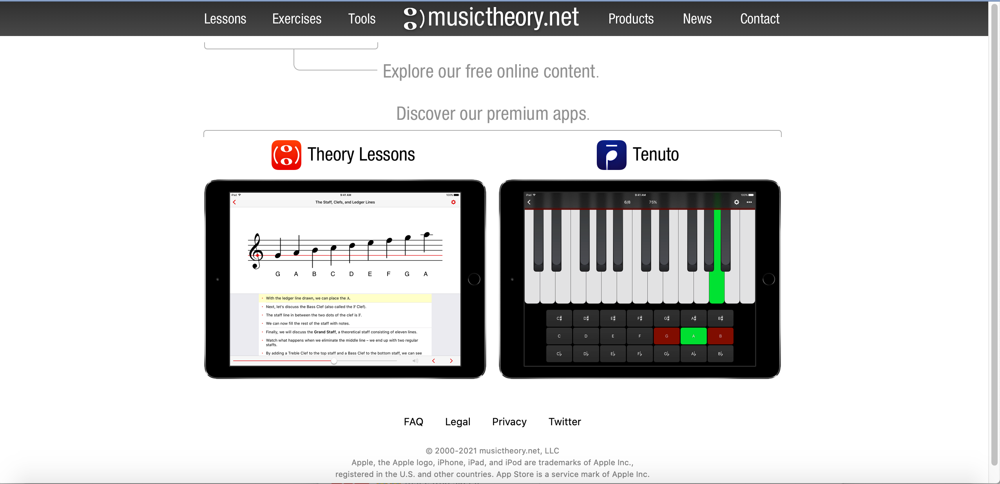

# Learning Music the Easy Way
## Assignment 1: Heuristic Evaluation
### Ariel Kuo | Spring 2022 
DH 110: User Experience and Design 

**About the Project**  
blah blah

### Competitor 1: musictheory.net

URL: https://www.musictheory.net/ 

**About the Website**  
blah blah 

 

**Overall Evaluation** 
blah blah 

**Heuristic Evaluation** 

| Heuristic      | Evaluation     | Recommendation | Severity Rating | 
| ------------- | ------------- | ----- | 
| Visibility of system status | 1 | 1 | 1| 

**Credits** 
https://www.interaction-design.org/literature/article/heuristic-evaluation-how-to-conduct-a-heuristic-evaluation 
https://www.nngroup.com/articles/how-to-rate-the-severity-of-usability-problems/ 
