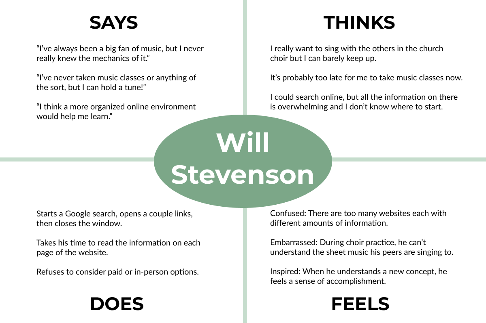
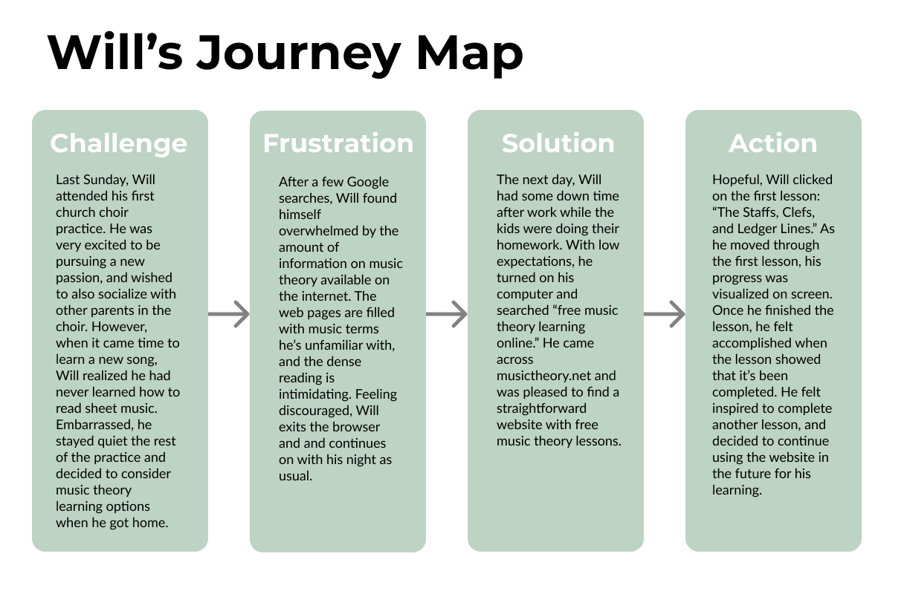

# Assignment 4: Persona + Usage Scenario

## Ariel Kuo DH 110

### The Purpose of UX Storytelling

Creating a product requires a deep understanding of the target audience. In order to gain perspective from the user's side, researchers create personas that represent people who would use the product. Exploring the different challenges and emotions a user might feel can greatly improve the user-centered design. In this project, I am creating two personas of middle-aged men that wish to learn music theory for unique personal reasons. In telling their story, I aim to highlight proposed features of the product.

### Persona 1: Will Stevenson - church choir attendee

 

### Empathy Map

### Feature 1: Music theory lessons with progress visualizations

blah blah

### Journey Map

