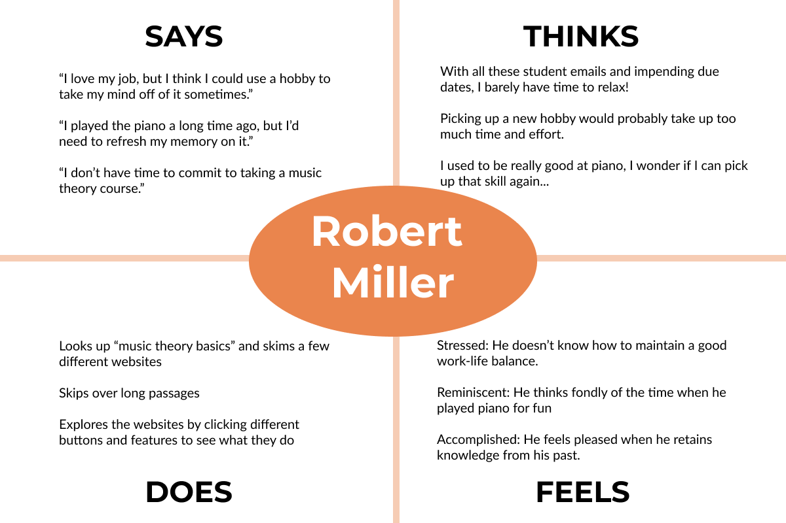
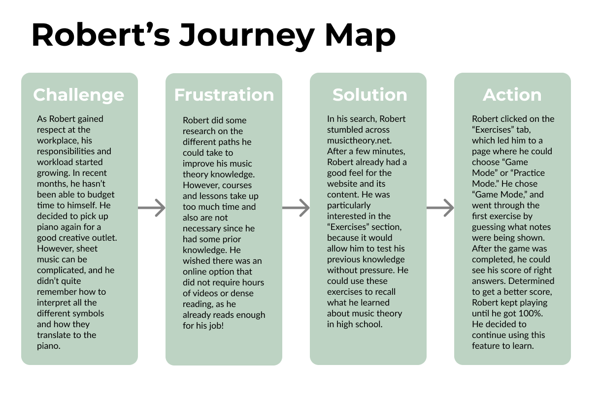

# Assignment 4: Persona + Usage Scenario

## Ariel Kuo DH 110

### The Purpose of UX Storytelling

Creating a product requires a deep understanding of the target audience. In order to gain perspective from the user's side, researchers create personas that represent people who would use the product. Exploring the different challenges and emotions a user might feel can greatly improve the user-centered design. In this project, I am creating two personas of middle-aged men that wish to learn music theory for unique personal reasons. In telling their story, I aim to highlight proposed features of the product.

### Persona 1: Will Stevenson - church choir attendee

 

### Empathy Map

### Feature 1: Music theory lessons with progress visualizations

**Why would Will use the feature?**

After struggling at choir practice, Will embarked on a personal mission to learn how to read music. Will had never taken classes in music theory, and needed a safe, comfortable learning environment. After browsing through an array of websites overloaded with information, Will felt discouraged at first. The next day he revisited the activity and stumbled upon musictheory.net. To his surprise, he found easy-to-understand and encouraging lessons about music theory basics. Finishing a lesson gave Will a small sense of accomplishment and encouraged growth.

**How does Will experience the feature?**

From the homepage of musictheory.net, Will finds the "Lessons" tab and clicks on it. The page shows a list of available music theory lessons, numbered from start to finish and increasing in complexity. The first lesson, "The Staffs, Clefs, and Ledger Lines" is highlighted, indicating that this is the first step in learning. Will clicks on the first lesson, and the next page presents a clear, simple text line with the definition of a staff and visual examples. Once Will finishes reading and understanding the page, he clicks the forward arrow button to move on to the next page of the lesson. As he moves through the lesson, his progress is highlighted visually at the bottom of the screen as a horizontal bar fills up. Once he goes through all the pages, Will feels accomplished when he sees that he's completed the first lesson (shown visually with a green check mark). Motivated by his success, Will continues to use the lesson feature.

### Journey Map

### Persona 2: Robert Miller - past piano player

 

### Empathy Map

### Feature 2: Music theory exercises with game mode

**Why would Robert use the feature?**

Stressed from work, Robert wishes to pick up piano again as a side hobby. He was once good at piano, but has since forgotton some of the details about how to read sheet music and translate it to piano-playing. He doesn't want to take lessons or courses because he doesn't have enough free time to do so, and he also doesn't want to start from the beginning since he already knows some music theory. The game mode feature in the exercises on musictheory.net would provide the perfect fun, quick solution for Robert to brush up on his knowledge. The different options allow him to practice freely or use game mode, where he can see how much he remembers and what he still needs to work on.

**How does Will experience the feature?**

From the homepage of musictheory.net, Robert clicks on the "Exercises" tab. This leads him to select between "Game Mode" and "Practice Mode." He clicks "Game Mode" and selects the first exercise from the list: "Note Identification." Once he clicks the button, the game pops up greyed-out with a green "Start" button and "Settings." He first clicks on the "Settings" button, and sees that the game is set to 10 questions and no time limit. Satisfied with the default settings, Robert exits the settings with the "x" in the top right corner, and clicks on "Start." A note is displayed on the staff, and Robert makes a guess with the provided options. The note he guessed was correct, and the game shows the button he pressed as green. The next note he guessed wrong, and the note showed up in red while the correct answer was highlighted green. As he moves through the game, his score is being updated at the top of the screen. After all 10 questions, the screen shows his final score and a "Retry" button and a "Continue" button. Robert feels motivated to retry until he gets a perfect score. Robert now feels confident in his note identification skills, and is excited to try the other games available so he can pick up the piano again with ease.

### Journey Map

