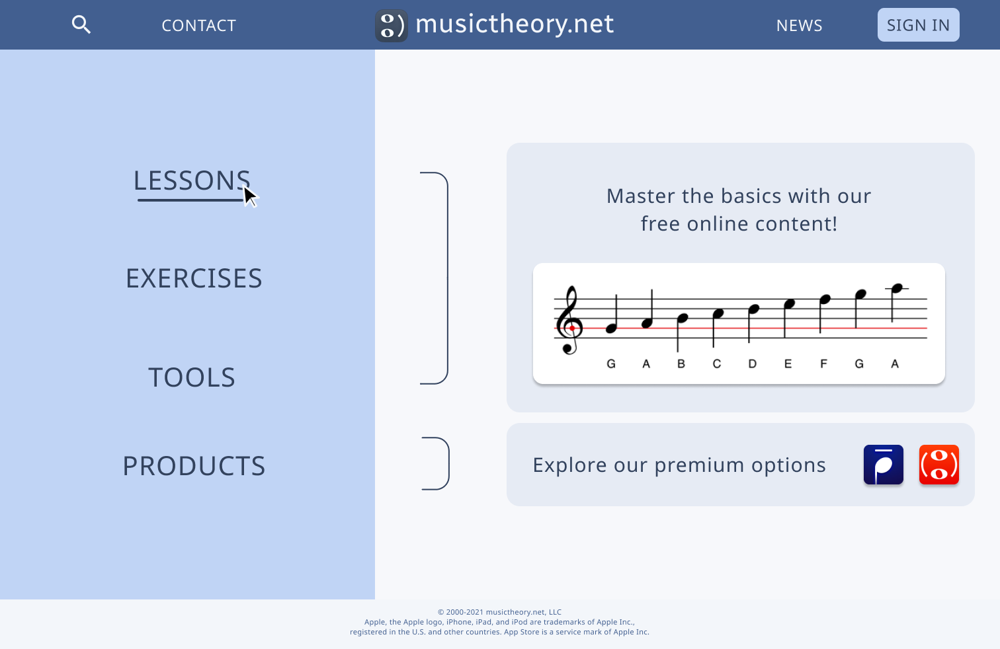

# Assignment 6: Interface Design

## Ariel Kuo DH 110

### Project Goal & Purpose

The goal of this project is to redesign the musictheory.net website to facilitate smooth learning and increase user engagement. Ideally, the website will be welcoming and intuitive to a middle-aged man.

The interface design was first developed with a hand-sketched wireframe, then digitized in Figma. I then created many iterations of the design, altering assets like font, shape, and color. Picking the right design is essential to to improving the usability of the website.

### Digitized Wireflow

Access my Figma file [here](https://www.figma.com/file/o6O85cjO6I7GwjE8vgIxS2/Light-Mode-UI?node-id=1011%3A3346) 

### Typography Variations

**Variation 1**

**Variation 2**

**Variation 3**

### Shape Variations

**Variation 1**

**Variation 2**

**Variation 3**

### Color Variations

**Variation 1 (Light Mode)**

**Variation 2 (Dark Mode)**

### Impression Test

Access the recording of my impression test [here](https://drive.google.com/file/d/1yd975e_5F3IsfR259x6pNe-0G2r1aGmC/view?usp=sharing) 

**Results**

The participant's response to the first impression of my home screen matched my goal of creating a clean and intuitive environment. From the short exposure the participant was able to quickly get an insight on the purpose of the website and notice the separate options between free and paid content, which they appreciated. 

When asked to criticize the design, the participant mentioned the fact that the user is already logged in, and they would like to see on the home page where the user would theoretically sign in. Taking this feedback, I have modified the profile icon to be a sign in button in the top right corner to show how a user might create or login to an account. After signing in, the user would see the original profile icon I included in the first design.

### Final Design

**Typeface**

Font Family: Sans Serif

Website title: Radio Canada, Regular, Size 40, Letter spacing 0.18px  
Body text: Noto Sans, Regular, Size 30, Letter spacing 1.15px  
Sidebar: Noto Sans, Regular, Size 40, Letter spacing 1.25px  
Small text: Noto Sans, Regular, Size 11, Letter spacing 3%  
Tab: Noto Sans, Regular, Size 24, Letter spacing 1px  
Profile icon: Noto Sans, Regular, Size 26, Letter spacing 1.25px  

I chose the second typography variation, which included the website title in Radio Canada and all other text in Noto Sans. Variation 1 was the same but with the website title in Barlow, which looked a bit too robust for my liking in the final design. Variation 3 used Radio Canada for the website title, but Open Sans for the rest of the text. Open Sans and Noto Sans looked very similar on the page, but I felt that Open Sans was so round and spread out that it was a little bit boring to see on the website. Noto Sans had the same clarity but looked slightly more professional to me. I sized the different texts accordingly, with more important functions in larger text.

**Shape**

The cards with body text and images were set to rounded corners of value 20.

Variation 1 of shape had rectangular body cards, which looked too harsh. Variation 3 had very rounded corners on the card, which looked too harshly round compared to the rest of the website. Therefore, I chose Variation 2 for the final design.

**Color Scheme**

Top bar and small text: 425F90  
Top bar headings and icons, bottom bar: F3F6FA  
Sidebar: C0D4F5  
Background: F7F8FB  
Body and Sidebar text, brackets: 32425E  

I chose blue as the main color family for the website, which was inspired by the original website's blue color for exercises. They used a bright royal blue, which I thought would be too harsh if used as a theme. I chose more muted indigo-blues because they are calming and welcoming, which is perfect for a website about learning targeted to a middle-aged audience. The page includes a dark bar at the top, like the original website, with a medium-shade sidebar and light background and body cards. This coloring puts the focus on the sidebar, which contains the main content of the website. Instead of using harsh whites and blacks for the text, I opted for slightly blue-toned light and dark colors to fit with the rest of the page.

**Layout**

Columns: 8, Margin 40, Gutter 16  
Rows: 6, Margin 75, Gutter 16  
 
8 columns was enough to separate the information on the screen, because the home page does not contain too many objects. Because I had 4 main options in the sidebar, I wanted 6 columns so that I could have the 4 options centered and equally-spaced. I adjusted the margins based on the top and bottom bars I wanted to include, and a gutter of 16 was sufficient to separate the content.

### Accessibility Check

The color contrast between text fields and their backgrounds were checked to ensure that they met the 4.5:1 ratio for accessibility. Each instance was evaluated for the light and dark modes.

### Interface Design Page

Access my Figma file [here](https://www.figma.com/file/o6O85cjO6I7GwjE8vgIxS2/Light-Mode-UI?node-id=1011%3A3346) to view the Design System used.
