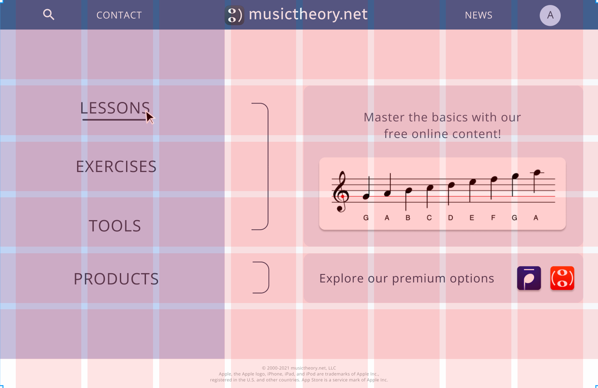
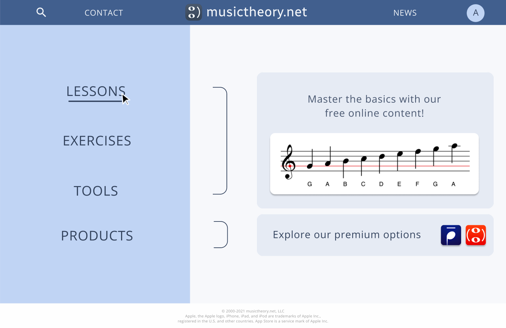
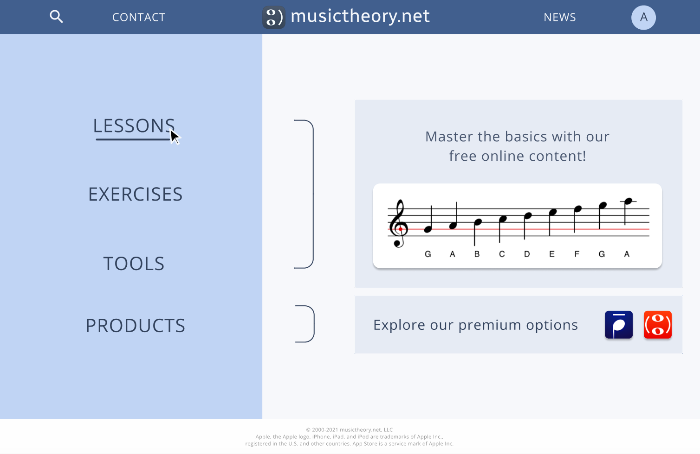
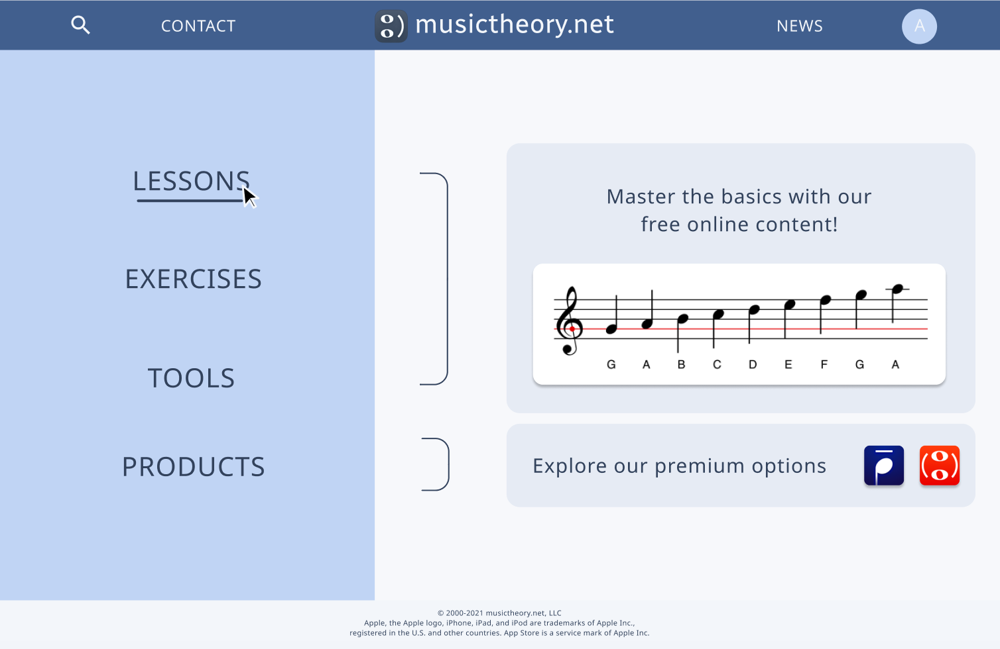
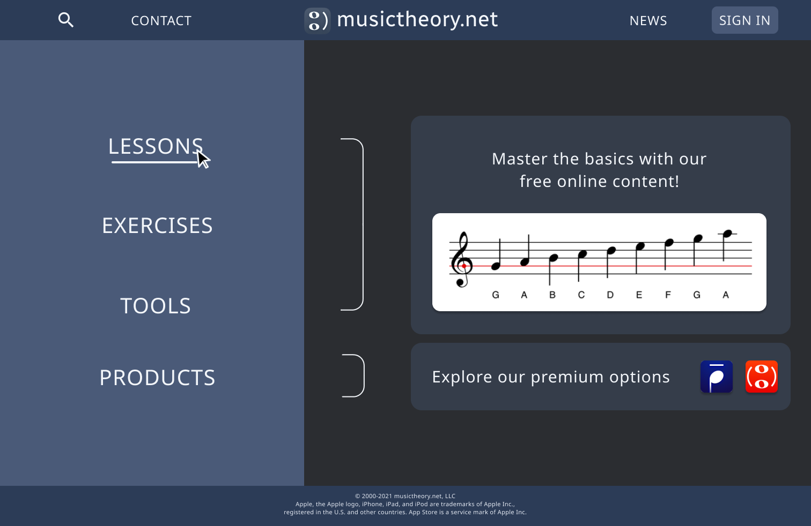
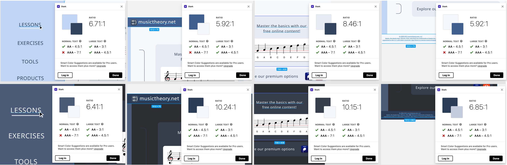

# Assignment 6: Interface Design

## Ariel Kuo DH 110

### Project Goal & Purpose

The goal of this project is to redesign the musictheory.net website to facilitate smooth learning and increase user engagement. Ideally, the website will be welcoming and intuitive to a middle-aged man.
The interface design was first developed with a hand-sketched wireframe, then digitized in Figma. I then created many iterations of the design, altering assets like font, shape, and color. Finding the right design is essential to to improving the usability of the website.

### Digitized Wireflow

Access my Figma file [here](https://www.figma.com/file/o6O85cjO6I7GwjE8vgIxS2/Light-Mode-UI?node-id=1011%3A3346) 

### Layout

### Typography Variations

### Shape Variations

### Color Variations

### Final Design

**Typeface**

Font Family: Sans Serif

Website title: Radio Canada, Regular, Size 40, Letter spacing 0.18px
Body text: Noto Sans, Regular, Size 30, Letter spacing 1.15px
Sidebar: Noto Sans, Regular, Size 40, Letter spacing 1.25px
Small text: Noto Sans, Regular, Size 11, Letter spacing 3%
Tab: Noto Sans, Regular, Size 24, Letter spacing 1px
Profile icon: Noto Sans, Regular, Size 26, Letter spacing 1.25px

**Shape**

The cards with body text and images were set to rounded corners of value 20.

**Color Scheme**

Top bar and small text: 425F90
Top bar headings and icons, bottom bar: F3F6FA
Sidebar: C0D4F5
Background: F7F8FB
Body and Sidebar text, brackets: 32425E

**Layout**

Columns: 8, Margin 40, Gutter 16
Rows: 6, Margin 75, Gutter 16

### Impression Test

Access the recording of my impression test [here](https://www.figma.com/file/o6O85cjO6I7GwjE8vgIxS2/Light-Mode-UI?node-id=1011%3A3346) 

### Accessibility Check

The color contrast between text fields and their backgrounds were checked to ensure that they met the 4.5:1 ratio for accessibility. Each instance was evaluated for the light and dark modes.

### Interface Design Page

Access my Figma file [here](https://www.figma.com/file/o6O85cjO6I7GwjE8vgIxS2/Light-Mode-UI?node-id=1011%3A3346) 
