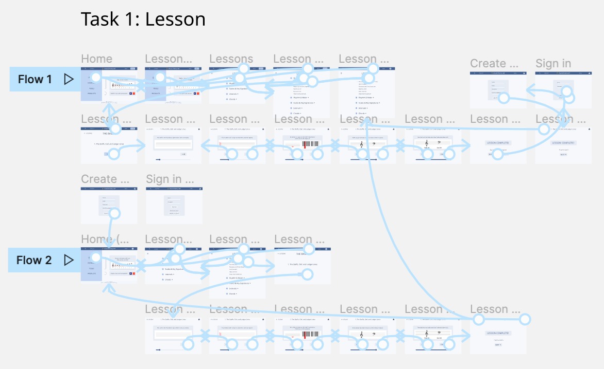
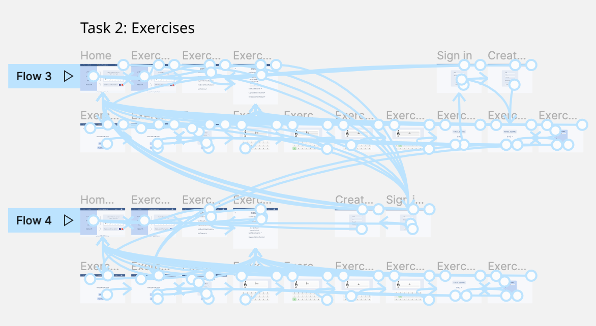

# Assignment 7: High Fidelity Prototype

## Ariel Kuo DH 110

### Project Goal & Purpose

The goal of this project is to redesign the musictheory.net website to facilitate smooth learning and increase user engagement. The target audience is a middle-aged male user whose goal is to learn music theory in an easy, intuitive way. 

### Interactive Prototype

The purpose of creating prototypes is to realistically simulate the user's experience with the product, without going through a strenuous coding process. The process of creating an interactive prototype involves designing the interface in wireframes, then connecting them with animations in the correct sequence. During the process, the designer learns a lot about what obstacles or points of confusion a user might face, and about the configuration of interactions within the prototype. 

### Tasks

This prototype supports the following user tasks:

1. Finish the first available lesson and sign in. 
2. Finish the first available exercise and sign in. 

### Wireflows 

 

 

### Interactive Prototype 

[Task 1: Lessons](https://www.figma.com/proto/LBbSvZSTOUSZtRqt5HWdP2/Hifi-Prototype?node-id=1191%3A5563&scaling=scale-down&page-id=1191%3A5562&starting-point-node-id=1191%3A5563&show-proto-sidebar=1)

[Task 2: Exercises](https://www.figma.com/proto/LBbSvZSTOUSZtRqt5HWdP2/Hifi-Prototype?node-id=1191%3A7771&scaling=scale-down&page-id=1191%3A5559&starting-point-node-id=1191%3A7771&show-proto-sidebar=1)

### Cognitive Walkthrough

Documentation of in-class [cognitive walkthrough:](https://docs.google.com/document/d/1SVHo5a6SdAxNWC-FW8HDTuUPUEl6wyw2SSQ-AWyW1_8/edit)

Points of concern:

- "some prototype interactions with homepage main buttons" are missing
- "home page is covered at the left side"

Positive comments:

- "I like the color scheme, it's professional and clear"
- "I really liked the drop down option on the lessons menu!"

Addressing feedback:
- polished the prototype by including interactions for all main buttons, including home buttons and icons.
- made sure all sections of the screen were clearly visible in the prototype
- kept the color scheme and design due to positive feedback
- incorporated drop down option in the second task due to positive feedback on first task

